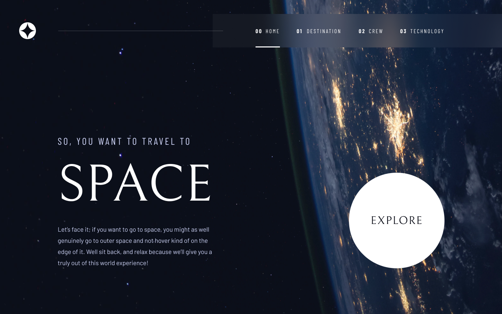

<h1 align="center">Space-tourism</h1>

<p align="center">Esse projeto é um site sobre viagem ao espaço e o layout foi elaborado pela <a href="https://www.frontendmentor.io/challenges/space-tourism-multipage-website-gRWj1URZ3">Frontend Mentor</a>.</p>

---

<h1 align="center">
  
</h1>

<a href="https://andersonszdc.com">Ver o projeto no ar</a>

### Features

- [x] Static generation
- [x] Totalmente responsivo

### Pré-requisitos

Antes de começar, você vai precisar ter instalado em sua máquina as seguintes ferramentas:
[Git](https://git-scm.com), [Node.js](https://nodejs.org/en/).

Além disto é bom ter um editor para trabalhar com o código como [VSCode](https://code.visualstudio.com/)

### Rodando a aplicação

```bash
# Clone este repositório
$ git clone https://github.com/andersonszdc/Space-tourism

# Acesse a pasta do projeto no terminal/cmd
$ cd Space-tourism

# Instale as dependências
$ npm install

# Para iniciar o servidor, execute este comando
$ npm run dev
```

### Tecnologias

As seguintes ferramentas foram usadas na construção do projeto:

- [NextJS](https://www.typescriptlang.org/)
- [TypeScript](https://www.typescriptlang.org/)
- [Styled Components](https://styled-components.com/)
- [Eslint](https://eslint.org/)

---

### Autor


Made with 💜 by andersonszdc

<a href="https://www.linkedin.com/in/anderson-souza-b28431198/" target="_blank"></a>
<a href="https://www.instagram.com/andersonszdc" target="_blank"></a>
